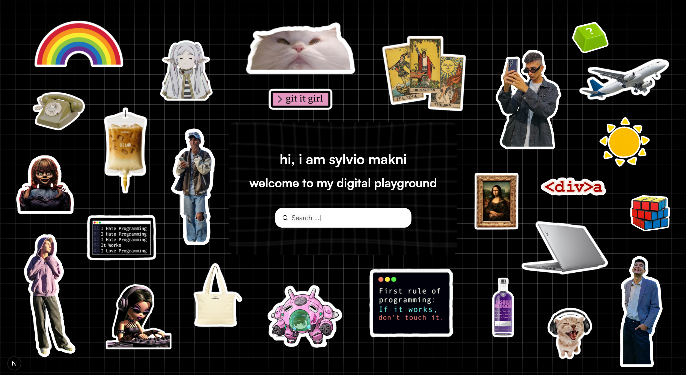
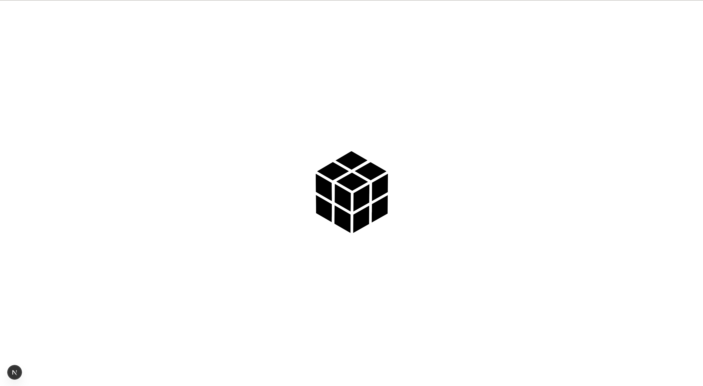
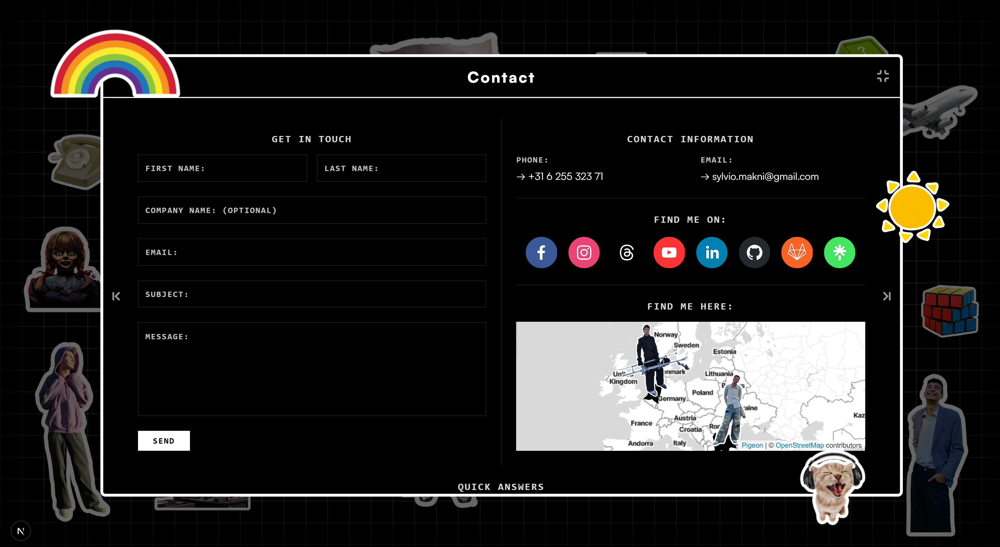
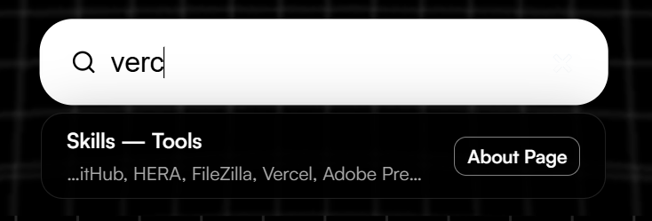
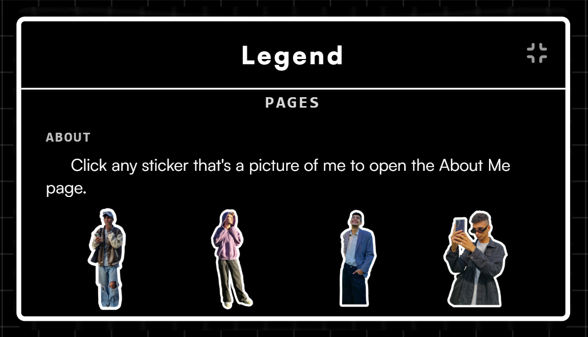
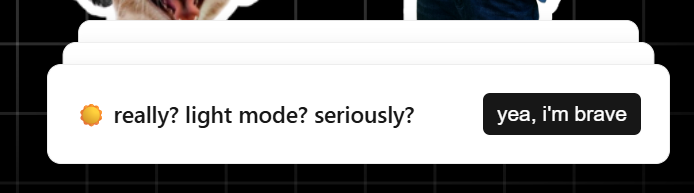

# Showcase Portfolio

A personal creative portfolio built to represent who I am — my interests, my projects, and my growth as a developer.

---

## Table of Contents

- [Overview & Vision](#overview--vision)
- [Preview](#preview)
- [Target Audience](#target-audience)
- [Tech Stack & Tools](#tech-stack--tools)
- [Dependencies & Libraries](#dependencies--libraries)
- [Architecture & Structure](#architecture--structure)
- [Folder Structure](#folder-structure)
- [Features](#features)
- [Version Control Workflow](#version-control-workflow)
- [Installation & Usage](#installation--usage)
- [Status & Roadmap](#status--roadmap)
- [Reflections](#reflections)
- [License](#license)
- [Acknowledgements & Inspiration](#acknowledgements--inspiration)

---

## Overview & Vision

This is my second portfolio, rebuilt from scratch during my third semester at Fontys ICT. The first version gave me a lot of useful feedback — it consistently pointed toward two things: creativity and usability. Those became the driving principles of this rebuild.

Rather than defaulting to flashy visuals or a purely technical showcase, this portfolio leads with personality. It's built around an **interactive sticker board** on the landing page, where each sticker represents a piece of who I am and links to a different section of the portfolio. Usability was just as important as the creative direction — a central search bar lets visitors find anything instantly, and a legend modal explains how to navigate the portfolio, switch themes, and use its features. The goal was simple: build something that actually reflects me — not just what I can code, but who I am and what I care about.

---

## Preview













---

## Target Audience

- Internship recruiters in front-end, UX, mobile, or creative development
- Employers in digital and tech-related fields
- Teachers and assessors at Fontys ICT
- Creative and technical professionals curious about my work
- Anyone interested in following my process and growth

---

## Tech Stack & Tools

| Category        | Tools                 |
| --------------- | --------------------- |
| Framework       | Next.js 16 + React 19 |
| Styling         | CSS Modules           |
| Deployment      | Vercel                |
| Version Control | GitHub + GitLab       |
| Design          | Figma                 |
| AI Assistance   | Claude AI             |

---

## Dependencies & Libraries

| Library                                     | Purpose                           | Where it's used                     |
| ------------------------------------------- | --------------------------------- | ----------------------------------- |
| `framer-motion`                             | Drag, snap, and spring animations | Landing page sticker board          |
| `fuse.js`                                   | Fuzzy search                      | Search bar dropdown                 |
| `typed.js`                                  | Typewriter effect                 | Search bar overlay on landing page  |
| `lottie-react`                              | JSON-based animations             | Loader and empty states             |
| `next-themes`                               | Dark/light mode                   | Global theme toggle                 |
| `sonner`                                    | Toast notifications               | Theme and sound toggle feedback     |
| `lucide-react`                              | Icon set                          | Throughout the UI                   |
| `react-social-icons`                        | Social media icons                | Contact page                        |
| `resend` + `@react-email/render`            | Email sending                     | Contact form submission             |
| `sweetalert2`                               | Alert dialogs                     | Contact form success/error messages |
| `pigeon-maps`                               | Interactive map                   | Contact page location               |
| `@developer-hub/liquid-glass`               | Liquid glass effect               | Hero container on landing page      |
| `@mui/lab` + `@mui/material` + `@emotion/*` | Masonry layout                    | Projects page grid                  |

---

## Architecture & Structure

_Coming soon — overview of the page structure, modal/pop-up window system, data layer, and component organization._

---

## Folder Structure

```
├── 📁 public/
│   ├── 📁 fonts/                               # Two typefaces: Satoshi (UI) and Space Mono (code/accents)
│   ├── 📁 icons/                               # Tech stack icons used in the Projects' tags section
│   ├── 📁 images/                              # Project thumbnails and profile photo
│   ├── 📁 readme-preview/                      # Screenshots used in the README Preview section
│   ├── 📁 sounds/
│   │   └── 🎵 click.mp3                        # UI click sound effect (toggleable)
│   ├── 📁 stickers/                            # 31 draggable sticker assets for the landing page
│   ├── 📁 videos/                              # Reserved for future video assets
│   ├── 🖼️ file.svg
│   ├── 🖼️ globe.svg
│   ├── 🖼️ next.svg
│   ├── 🖼️ vercel.svg
│   └── 🖼️ window.svg                           # Default Next.js SVG assets
├── 📁 src/
│   ├── 📁 app/
│   │   ├── 📁 about/
│   │   │   └── 📄 page.jsx                     # About page route
│   │   ├── 📁 api/
│   │   │   └── 📁 send/
│   │   │       └── 📄 route.js                 # API route for contact form email (Resend)
│   │   ├── 📁 contact/
│   │   │   └── 📄 page.jsx                     # Contact page route
│   │   ├── 📁 projects/
│   │   │   └── 📄 page.jsx                     # Projects page route
│   │   ├── 📁 providers/
│   │   │   └── 📄 SoundProvider.jsx            # Global sound context/provider
│   │   ├── 📄 favicon.ico
│   │   ├── 🎨 globals.css                      # Global styles and CSS variables
│   │   ├── 📄 layout.jsx                       # Root layout (fonts, providers, metadata)
│   │   ├── 📄 page.jsx                         # Landing page (sticker board)
│   │   ├── 🎨 page.module.css
│   │   └── 📄 providers.jsx                    # Wraps app with ThemeProvider + SoundProvider
│   ├── 📁 assets/
│   │   ├── ⚙️ 2x2 Modular Rubiks cube [Dark Mode].json
│   │   ├── ⚙️ 3x3 Cube Loader #3.json
│   │   ├── ⚙️ Isometric Cube(s) Empty State #2.json
│   │   ├── ⚙️ Trim Lines Preloader.json
│   │   ├── ⚙️ VRAR Cubes [Dark Theme].json
│   │   └── ⚙️ loader-animation.json            # Lottie JSON animation files
│   ├── 📁 components/
│   │   ├── 📁 About Page Content/
│   │   │   ├── 📄 AboutContent.jsx
│   │   │   └── 🎨 AboutContent.module.css
│   │   ├── 📁 Contact Page Content/
│   │   │   ├── 📄 ContactContent.jsx
│   │   │   └── 🎨 ContactContent.module.css
│   │   ├── 📁 Home Tiles/
│   │   │   ├── 📄 HomeTiles.jsx
│   │   │   └── 🎨 HomeTiles.module.css
│   │   ├── 📁 Interactive Background/
│   │   │   ├── 📄 InteractiveBackground.jsx
│   │   │   └── 🎨 InteractiveBackground.module.css
│   │   ├── 📁 Legend Modal/
│   │   │   ├── 📄 LegendModal.jsx
│   │   │   └── 🎨 LegendModal.module.css
│   │   ├── 📁 Legend Page Content/
│   │   │   ├── 📄 LegendContent.jsx
│   │   │   └── 🎨 LegendContent.module.css
│   │   ├── 📁 Loader/
│   │   │   ├── 📄 Loader.jsx
│   │   │   └── 🎨 Loader.module.css
│   │   ├── 📁 Map/
│   │   │   └── 📄 Map.jsx
│   │   ├── 📁 Page Modal/
│   │   │   ├── 📄 PageModal.jsx
│   │   │   └── 🎨 PageModal.module.css
│   │   ├── 📁 Projects Page Content/
│   │   │   ├── 📄 ProjectsContent.jsx
│   │   │   └── 🎨 ProjectsContent.module.css
│   │   ├── 📁 Search Bar/
│   │   │   ├── 📄 SearchBar.jsx
│   │   │   └── 🎨 SearchBar.module.css
│   │   ├── 📁 Type Writer/
│   │   │   └── 📄 Typewriter.jsx
│   │   └── 📄 email-template.jsx               # Each component is co-located with its CSS module
│   ├── 📁 data/
│   │   ├── ⚙️ about.json
│   │   ├── ⚙️ contact.json
│   │   ├── ⚙️ legend.json
│   │   ├── ⚙️ projects.json
│   │   └── 📄 searchIndex.js                   # JSON-driven content for each section + Fuse.js search index
├── ⚙️ .gitignore                               # Excludes node_modules, .env.local, build output, and editor files
├── 📄 LICENSE                                  # MIT License
├── 📝 README.md                                # Project documentation
├── 📄 eslint.config.mjs                        # ESLint configuration
├── ⚙️ jsconfig.json                            # Path aliases and JS config for Next.js
├── 📄 next.config.mjs                          # Next.js configuration
├── ⚙️ package-lock.json                        # Lockfile — ensures consistent dependency installs
└── ⚙️ package.json                             # Project metadata and dependencies
```

---

## Features

- **Interactive sticker board** — The landing page is built around a collection of draggable stickers, each representing a personal interest or personality trait. Stickers can be freely moved around the page using smooth Framer Motion drag interactions with spring-based snap animations.
- **Dark / light mode** — A persistent theme toggle powered by `next-themes`, with a toast notification (via Sonner) confirming the switch.
- **Sound toggle** — UI click sounds can be turned on or off globally via a sound context provider, with toast feedback on toggle.
- **Global search** — A fuzzy search bar (Fuse.js) lets visitors quickly navigate to any section or project. Triggered from the landing page, it surfaces results in a dropdown overlay with a typewriter animation (Typed.js).
- **Projects page** — A masonry grid layout (MUI Lab) displaying project cards with thumbnails, descriptions, and tech stack tags. All content is pulled from a JSON data file.
- **About page** — Personal background, skills, and tech stack icons, driven by JSON data.
- **Contact page** — A contact form connected to Resend for real email delivery, with SweetAlert2 confirmation/error dialogs, social media links, and an interactive map (Pigeon Maps) showing my location.
- **Animated loader** — A Lottie-based loading animation shown on initial page load.
- **Liquid glass hero** — A `@developer-hub/liquid-glass` container used as a styled hero element on the landing page.
- **JSON-driven content** — All page content (projects, about, contact details, legend) lives in `/src/data/` as JSON files, keeping data cleanly separated from UI components.
- **Responsive layout** — Desktop-first design scaled dynamically using a viewport-width ratio, so the layout adapts proportionally across different screen sizes without relying on traditional CSS breakpoints.

---

## Version Control Workflow

This project was version-controlled across both **GitHub** and **GitLab**, kept in sync throughout development.

All active development happened on a `dev` branch — a dedicated space to experiment, break things, and iterate freely without affecting the stable version of the project. Once everything was working correctly and the project was in a stable, complete state, all changes were merged into `main` as a final version.

Commit frequency was inconsistent throughout the project — there were stretches of weeks without a push. Since this is a solo project with no collaborators or deadlines depending on the repository, it didn't cause any issues, but it's something I'd approach more consistently in a team or professional setting.

---

## Installation & Usage

The deployed project is live at: _[Vercel link coming soon]_

To run it locally:

```bash
# Clone the repository
git clone <repo-url>
cd showcase-portfolio

# Install dependencies (this also restores everything excluded by .gitignore)
npm install

# Start the development server
npm run dev
```

> **Note:** A `.env.local` file is required for the contact form to work. This file is excluded via `.gitignore` and not included in the repository. Without it, emails won't send — all other features will run fine. Create `.env.local` at the root with:
>
> ```
> RESEND_API_KEY=your_api_key_here
> ```

**Requirements:** Node.js v18 or higher.

Open [http://localhost:3000](http://localhost:3000) in your browser.

---

## Status & Roadmap

The portfolio is currently complete with its core feature set: a draggable interactive sticker board, dark/light mode, a sound toggle, a fuzzy search bar that lets visitors navigate directly to any section or project, a working contact form with real email delivery, and JSON-driven content sections where all page data is imported from structured JSON files rather than hardcoded into components.

**Planned improvements:**

- Mobile-friendly redesign that adapts the sticker board for smaller screens
- More projects that better showcase my skills and knowledge
- Better project descriptions with proper READMEs for each one
- Expanded use of remaining sticker assets

---

## Reflections

This was my first project built with Next.js and React, and honestly, it taught me more than I expected — not just about the frameworks themselves, but about how to think about a project before writing a single line of code. Folder organisation, component grouping, co-locating styles with CSS Modules — these aren't the exciting parts of building something, but getting them right made everything else easier.

One of the bigger realisations was learning to work with what's already out there. I came in knowing I couldn't build everything from scratch, and leaning into the right dependencies and libraries was a conscious and worthwhile decision — it let me focus on the things that actually mattered for this project.

On the technical side, I got a lot more comfortable with `useState` and properly understanding destructuring — both for props and for hooks. Small things, but they add up. I'm glad I didn't use TypeScript for this — combining Next.js, React, and TypeScript all at once as a first project would have been too much. That said, I plan on incorporating it in one of my next university projects, where I can experiment, make mistakes, and learn without too much pressure.

If I were to do it again, I'd largely keep the same structure — the component grouping and CSS Module approach held up well and I'd carry that pattern forward. The one thing I'd do differently is take Git more seriously, even on a solo project. Consistent, meaningful commits are a good habit no matter who's depending on the repo, and this project was a good reminder of that.

---

## License


This project is licensed under the **MIT License** — meaning the code is open to read, learn from, and reference.

That said, this portfolio represents my personal work, identity, and design. Please don't copy the concept, layout, or content wholesale and present it as your own. Inspiration is welcome; imitation isn't.

Feedback and suggestions are always welcome — feel free to open an issue or reach out directly.

---

## Acknowledgements & Inspiration

- https://youtu.be/_tWh4cYCTv0?si=Ah-8Pm-1UXrFJinl
- https://www.gucduck.com/
- https://www.pinterest.com
- https://www.awwwards.com
